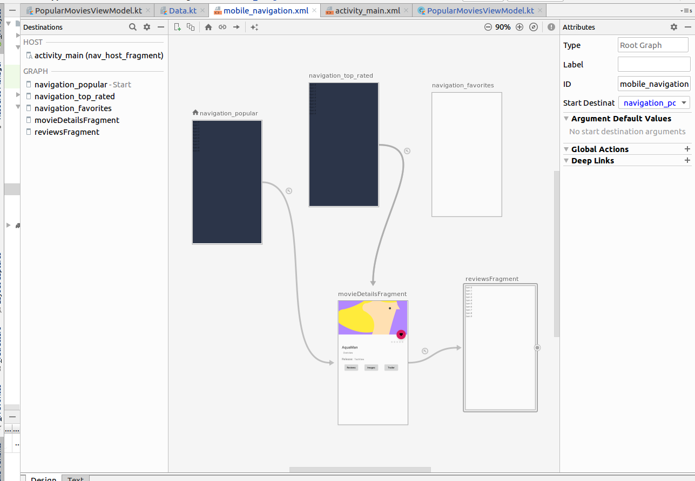
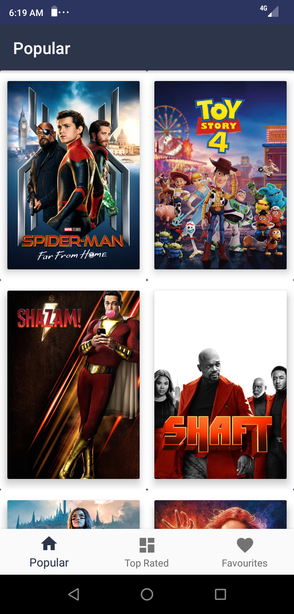
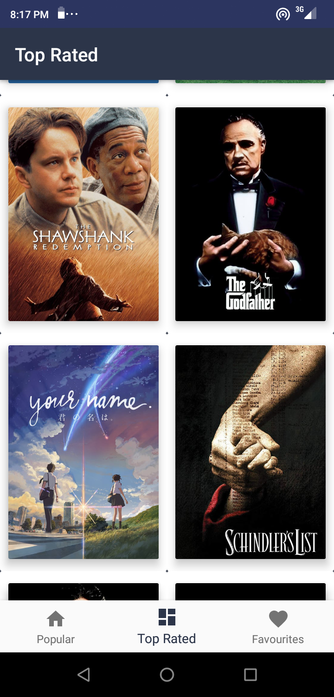
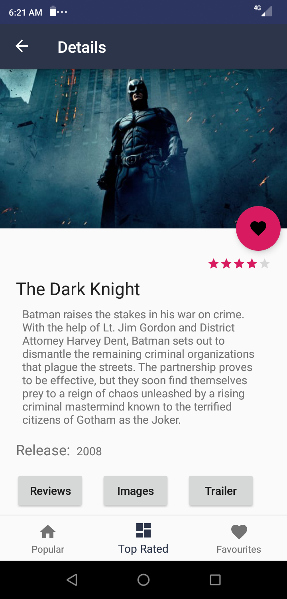
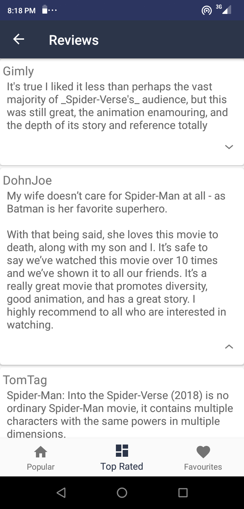

## Moviz
This project is an Android application written entirely using the Kotlin programming language.The sole purpose of the
project is to teach how Kotlin can be used in a full functional application. A run down of the current UI of the application is shown below.
The project is implemented using [Android Navigation component](https://developer.android.com/guide/navigation/navigation-getting-started).
The project also makes use of [Paging library support(infinite scrolling)](https://developer.android.com/topic/libraries/architecture/paging)
with the adapters or controllers implemented using [Epoxy Library](https://github.com/airbnb/epoxy) . The main use of Epoxy library in the project is for paging.
Networking is handled using [Retrofits library](https://square.github.io/retrofit/) . The API used is the [Movie Database API](https://developers.themoviedb.org/3/getting-started/introduction). You will have to get 
your own API key and replace it within the project gradle.properties file by putting

TMDB_KEY="YOUR API KEY"

